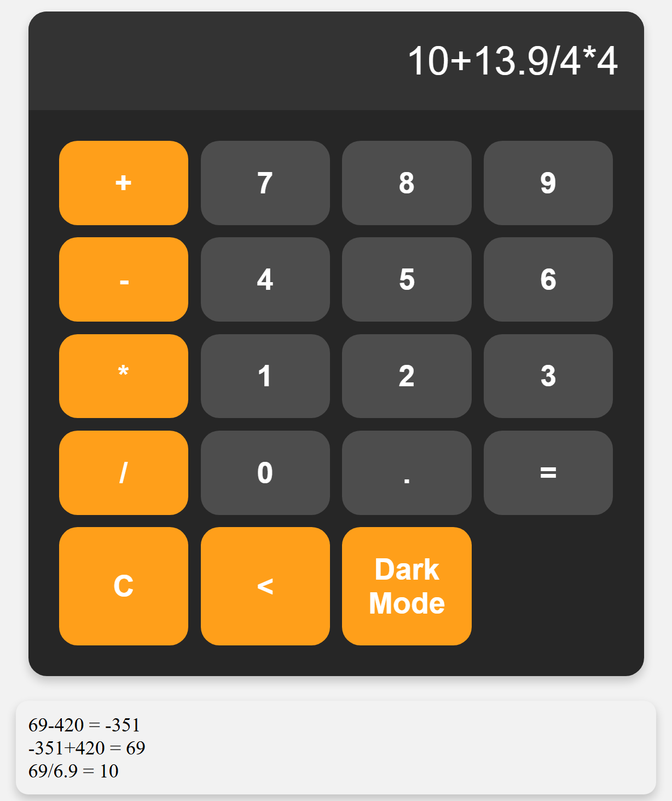

# FRP Calculator
 A demonstration of building a calculator app using **only** Functional Reactive Programming in Typescript!</br>
 Includes extra features like 
 1. history of calculations
 2. alternative user input validation
 3. dark mode theme. </br>
 
 Author: **Aaron** </br>



## Usage

Setup (requires node.js):

```bash
> npm install
```

Start tests (incomplete):

```bash
> npm test
```

Serve up the App (and ctrl-click the URL that appears in the console)

```bash
> npm run dev
```
